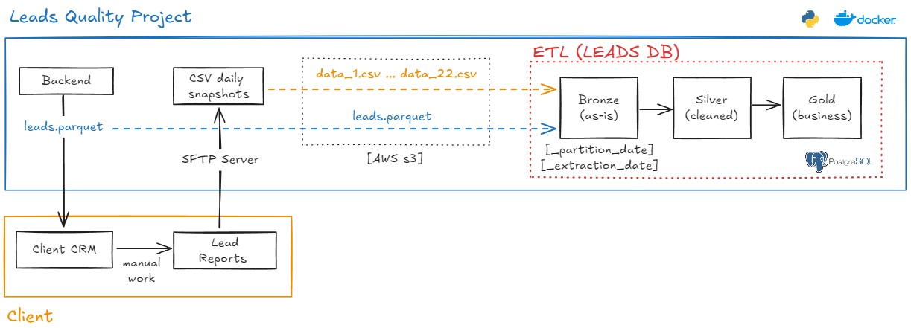
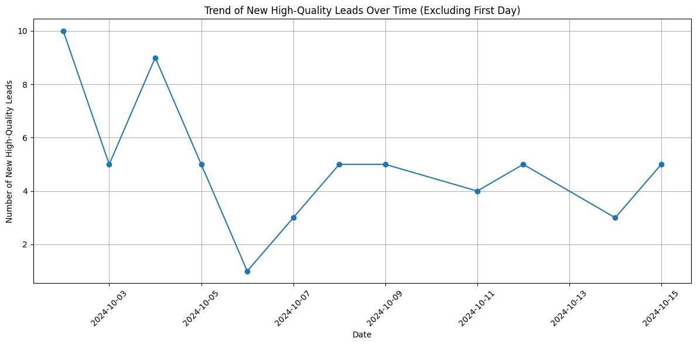

# HomeBuddy ETL 



## Table of Contents

- [Project Structure](#Project-Structure)
- [Setup Instructions](#Setup-Instructions)
  - [Prerequisites](#Prerequisites)
  - [Environment Variables](#Environment-Variables)
  - [Build and Run](#Build-and-Run)
- [Services](#services)
- [Project Definition](#Project-Definition)
  - [Medallion Architecture](#Medallion-Architecture)
  - [Source](#Source)
  - [Executing Python Scripts](#Executing-Python-Scripts)
  - [Bronze Layer](#Bronze-Layer)
  - [Silver Layer](#Silver-Layer)
  - [Gold Layer](#Gold-Layer)
  - [The Jupyter Notebook](#The-Jupyter-Notebook)
    - [EDA on Lead Quality Matching](#EDA-on-Lead-Quality-Matching)
  - [Entity-Relationship Model](#Entity-Relationship-Model)

## Project Structure

- **my_project/**
    - **.devcontainer/**
      - devcontainer.json
    - **sql_scripts/**
      - **schemas/**
        - create_schemas.sql
      - **bronze/**
        - create_bronze_tables.sql
      - **silver/**
        - create_silver_tables.sql
        - apply_silver_types.sql
      - **gold/**
        - create_gold_views.sql
    - **etl/**
      - __init__.py
      - step1_postgres_data_definition.py
      - step2_load_to_postgres.py
      - step3_partition_and_load_all_csv.py
      - step4_data_types_postgres.py
      - step5_create_gold_tables.py
      - step6_insert_into_gold_tables.py
      - **utils/**
        - utils_checks_db.py
        - utils_connection.py
        - extract.py
        - transform.py
    - **img/**
      - etl-leads-project.png
    - **your_jup_notebooks/**
      - test_s3_access.ipynb
      - silver_EDA.ipynb
    - **.env**
    - **.gitignore**
    - **.python-version**
    - **Dockerfile**
    - **docker-compose.yml**
    - **main.py**
    - **requirements.txt**
    - **README.md**

## Setup Instructions

### Prerequisites

Make sure you have the following installed on your local development environment:

- [Docker](https://www.docker.com/get-started)
- [Docker Compose](https://docs.docker.com/compose/install/)
- [VSCode](https://code.visualstudio.com/) with the [Remote - Containers extension](https://marketplace.visualstudio.com/items?itemName=ms-vscode-remote.remote-containers)

Make sure to inclue a .gitignore file with the following information:
- *.pyc (to ignore python bytecode files)
- .env (to ignore sensitive information, such as database credentials)
- data/* (to ignore the source data, such as CSV files)

### Environment Variables

The .gitignore file, ignores the ´.env´ file for security reasons. However, since this is just for educational purposes, follow the step below to include it in your project. If you do not include it, the docker will not work.

Create a `.env` file in the project root with the following content:

- POSTGRES_USER=myuser
- POSTGRES_PASSWORD=mypassword
- POSTGRES_DB=mydatabase
- POSTGRES_HOST=postgres
- POSTGRES_PORT=5432
- S3_IAM_ROLE_ARN=...
- S3_IAM_USER_ARN=...
- S3_ACCESS_KEY_ID=...
- S3_SECRET_ACCESS_KEY=...
- S3_REGION=eu-north-1
- S3_BUCKET_NAME=...
- S3_PARQUET_BUCKET=.../parquet
- S3_PARQUET_FILE=parquet/leads.parquet
- S3_SFTP_BUCKET=...
- S3_SFTP_FILES_PREFIX=SFTP/data_
- JUPYTER_TOKEN=123

### Build and Run

1. **Clone the repository:**

   ```bash
   git clone https://github.com/caiocvelasco/homebuddy-task.git
   cd your_repo_folder

2. **Build and start the containers:**

    When you open VSCode, it will automatically ask if you want to reopen the repo folder in a container and it will build for you.

    **Note:** I have included the command `"postCreateCommand": "docker image prune -f"` in the __.devcontainer.json__ file. Therefore, whenever the docker containeirs are rebuilt this command will make sure to delete the `unused (dangling)` images. The `-f` argument ensures you don't need to confirm if you want to perform this action.

### Services

- **Postgres**: 
  - A PostgreSQL database instance.
  - Docker exposes port 5432 of the PostgreSQL container to port 5432 on your host machine. This makes service is accessible via `localhost:5432` on your local machine for visualization tools such as PowerBI and Tableau. However, within the docker container environment, the other services will use the postgres _hostname_ as specified in the `.env` file (`POSTGRES_HOST`).
  - To test the database from within the container's terminal: `psql -h $POSTGRES_HOST -p 5432 -U $POSTGRES_USER -d $POSTGRES_DB`
- **Python**: A container running Python 3.9.13 with necessary dependencies.
- **Jupyter Notebook**: A Jupyter Notebook instance to build your ETL Pipeline and interact with the data. 

## Project Definition

### Medallion Architecture
  * I created 3 schemas within the PostgreSQL database to mimic the Medallion Architecture (bronze, silver, and gold layers) usually found in Data Warehouse solutions. 
  * The schemas can be found within the __sql_scripts__ folder and are called:
    * bronze (the raw layer, where we store raw data, with minimal transformations/standardization)
    * silver (the data model layer, where we transform the CSV data)
    * gold (the analytics layer, where we build the final tables ready to be consumed by analysts)

### Source
The source data is composed of CSV files with the `data_01.csv ... data_22.csv`, each one containing leads data from a CRM system.

Data is stored in S3 bucket called `<YOUR_S3_STORAGE>`.

### Executing Python Scripts
  * Running
    * Git Bash: `cd /workspace`
    * Run: `python main.py`
      * This will run all the `step1...py` to ... `step6...py` in order and process all the pipeline.
      * This will:
        * Create all the schemas and tables in Postgres
        * Perform extraction from S3 to Pandas
        * Perform transformation in Pandas
        * Insert data from Pandas to Tables in Postgres in all schemas (Bronze, Silver, and Gold)
  * Note that the `/workspace/etl/utils` folder contains modules with connection details to s3 and checks done against Postgres during the inserting process into silver

### Bronze Layer

  * **CSV_SNAPSHOTS**
    * All CSVs, after minimal transformations to ensure standardization across files, were stored. Each of them is traceable by a `_partition_date`.
      * `_partition_date`: dates from 2024-10-01 to from 2024-10-22 were created to simulate a daily ingestion process and track each CSV.
      * **Minimal transformation to ensure standardization and facilitate ingestion:**
        * Source: `/workspace/etl/utils/extract.py`
          * Function: `minimal_clean_csv()`
            * Clean and standardize the DataFrame by performing minimal transformations after extraction:
              * Renames columns to standardized names (e.g., 'CityName' to 'CITY', 'Appt Date' to 'APPT_DATE', etc).
              * Adds a 'location' column with NULL values if it does not exist so that all CSVs look the same.
              * Logs the changes and data types of the cleaned DataFrame.
          * Function: `extract_all_csv()`
            * Extract all relevant CSV files from S3, clean the data, and add partition and extraction dates.
            * The function processes multiple CSV files from S3 by:
              * Loading each CSV into a Pandas DataFrame (This DataFrame will contain all CSVs, partitioned by '_partition_date').
              * Cleaning and standardizing the data using `minimal_clean_csv` function.
              * Adding an extraction date for tracking when the data was pulled.
              * Adding a partition date based on the file index to identify each CSV in the DataFrame.
              * Returns: A concatenated DataFrame containing all processed CSV files partitioned by '_partition_date'.
          * Function: `extract_parquet()`
            * Extract and clean a Parquet file from S3, adding an extraction date.
        * Total of **82304** rows were inserted with **22** `_partition_date`s

  * **LEADS_PARQUET**
    * The parquet with leads' keys from a company's backend was ingested only one time and it will serve as **Source of Truth** for the lead quality process.
    * No transformations were applied.
    
### Silver Layer
  
  * **STG_CSV_SNAPSHOTS**
    * All 22 CSVs were stacked on top of each other, tracked by `_partition_date`.
    * The final CSV was cleaned and organized.
      * **Transformations:**
        * Source: `/workspace/etl/utils/transform.py`
          * Main Function: `clean_csv()`
            * Cleans CSV data based on the outlined steps.
            * General cleaning:
              * Drops rows containing "-----" in any column.
              * Replaces 'nan' and 'None' values with NULL (represented by pd.NA).
            * Column-specific cleaning:
              * ( 'Bronze' Column Name -> 'Silver' Column Name: xyz explanation )
              * 'ENTRYDATE' -> 'entry_date': Converts to 'YYYY-MM-DD' format. Invalid dates are set to NULL.
              * 'LEADNUMBER' -> 'lead_number': No cleaning performed.
              * 'email_hash': No cleaning performed.
              * 'phone_hash': No cleaning performed.
              * 'CITY' -> 'city': No cleaning performed.
              * 'STATE' -> 'state': Ensures valid 2-letter state codes. Invalid entries are replaced with NULL or inferred from location data.
              * 'ZIP' -> 'zip': Drops leading '0'. Ensures valid 5-digit integers. Invalid entries are set to NULL.
              * 'APPT_DATE' -> 'appt_date': Converts to 'YYYY-MM-DD'. Rows with 'nu' are dropped, and invalid entries are set to NULL.
              * 'Set' -> 'set': No cleaning performed.
              * 'Demo' -> 'demo': Converts True/False values to '1/0' and stores them as strings.
              * 'Dispo' -> 'dispo': No cleaning performed.
              * 'JOB_STATUS' -> 'job_status': No cleaning performed.
              * 'location': Cleans leading/trailing spaces. Extracts valid state codes if available.
              * '_extraction_date': No cleaning performed.
              * '_partition_date': No cleaning performed.
            * Post-processing:
              * After all transformations, all columns are converted to string type.

  * **STG_LEADS_PARQUET**
    * The `BRONZE.LEADS_PARQUET` was ingested with a few steps to guarantee quality of this **Source of Truth**.
      * **Transformations:**
        * Source: `/workspace/etl/utils/transform.py`
          * Main Function: `clean_parquet()`
            * Cleans a Parquet DataFrame by performing the following steps:
            * Drops rows with missing values in the first three ID columns.
            * Normalizes `email_hash` and `phone_hash` columns by converting them to lowercase and stripping whitespace.
            * Removes duplicate rows based on the first three ID columns.
            * Identifies and prints duplicates based on the combination of `email_hash` and `phone_hash`.
            * Identifies and prints duplicates across the first three ID columns.
            * Renames specific columns for consistency.
  
  * **STG_CSV_DATA_01 ... STG_CSV_DATA_22**
    * After all cleaning procedures, the 22 CSVs were separated into 22 tables, by `_partition_date`.
    * This is to simulate **AS IF** we were processing data daily and performing the transformations by finding out each day what "new issue" was present (_e.g.: on a certain day, the CSV files came with "-----" in the first row._) 
    * **Partitioning process:**
        * Source: `/workspace/etl/step3_partition_and_load_all_csv.py`
          * Main Function: `clean_csv()`
          * Uses `start_date = "2024-10-01"` and `end_date = "2024-10-22"` to separate the CSV into 22 tables. 
          * It creates a list of string dates and filters the `STG_CSV_SNAPSHOTS` for the specific date partitions, leading it into the respective `"stg_csv_data_{i:02}"` table in the Silver schema in Postgres.

### Gold Layer

  * **LEAD_QUALITY_MATCHING**
    * The `gold.lead_quality_matching` table aggregates and enriches lead data to enable advanced quality analysis and matching metrics. It builds upon the existing data from the silver schema while introducing new columns and logic for deeper insights.
    * New Columns Introduced:
      * email_match:
        * Description: Indicates whether a match based on the email hash is found.
        * Logic: Set to TRUE if parquet.email_hash is not NULL; otherwise, it is FALSE.
      * phone_match:
        * Description: Indicates whether a match based on the phone hash is found.
        * Logic: Set to TRUE if parquet.phone_hash is not NULL; otherwise, it is FALSE.
      * appointment_scheduled:
        * Description: Indicates if an appointment has been scheduled based on the set flag.
        * Logic: Set to TRUE if csv.set equals 1; otherwise, it is FALSE.
      * demo_scheduled:
        * Description: Indicates if a demo has been scheduled based on the demo flag.
        * Logic: Set to TRUE if csv.demo equals 1; otherwise, it is FALSE.
      * conversion_rate:
        * Description: A placeholder for future calculations of the conversion rate; currently set to NULL.
      * lead_quality_flag:
        * Description: Classifies leads into categories based on the presence of scheduled appointments and demos.
        * Logic:
          * Set to High Quality if both set and demo are 1.
          * Set to Medium Quality if only set is 1.
          * Set to Low Quality if neither condition is met.
    * Joining Mechanism: 
      * The gold table is populated using a left join between the `silver.stg_csv_snapshots` and `silver.stg_leads_parquet` tables, matching on either email_hash or phone_hash. This enables the integration of various lead attributes while ensuring that unmatched leads from the CSV snapshots are still retained.   

### The Jupyter Notebook
I have put the Analysis part on a simple EDA format using a Jupyter Notebook.
Location: `/workspace/your_jup_notebooks/gold_EDA.ipynb`

#### EDA on Lead Quality Matching

**Analysis Overview**
This analysis focuses on understanding the quality of leads in the `GOLD.TEMP_LEAD_QUALITY_MATCHING` table within the gold schema. The goal is to assess lead matching quality based on email and phone hash comparisons, identify new leads, and track lead quality over time.

**Key Findings**
* Data Loading: Successfully loaded data from the `GOLD.TEMP_LEAD_QUALITY_MATCHING` table for analysis.

* Matching Scenarios:
  * Email Match Only: Identified the number of leads that matched based on email but not phone.
  * Phone Match Only: Counted leads that matched via phone hash only.
  * Both Matches: Assessed the total number of leads that matched both email and phone hashes.
  * Null Leads: Determined the number of records with null lead UUIDs, indicating potential data quality issues.
  * Lead Counts Per Partition: Analyzed the total number of unique leads grouped by partition date, providing insights into * lead trends over time.

* Total and New Leads:
  * Calculated total leads and identified new leads for each partition date, helping to understand the flow of new customer data.

* Lead Quality Distribution:
  * Examined the overall distribution of lead quality flags, categorizing leads into quality levels (e.g., High, Medium, Low), based on the `set` and `demo` columns.
  * Investigated lead quality by partition date to track changes and trends over time.

* High-Quality Leads:
  * Analyzed the daily increase in high-quality leads, tracking the growth of this segment and its implications for marketing and sales strategies.

  * Below, we can find an example of this daily trend in high-quality leads
  

  * **Conclusion:** 
    * This EDA provides insights into lead quality and matching efficiency, helping to inform strategies for improving lead generation and conversion efforts. The findings will guide decision-making processes related to customer outreach and engagement.
    * We can use `lead_uuid` as based to count leads because there is no NULL values for this ID across all 22 datasets after joining with the parquet file. Moreover, the combination of email_hash and phone_hash has matched across all datasets as well, so there was no error in the IDS cross the CSV daily process.

### (NEXT STEPS) Entity-Relationship Model

* The next steps would be to use the Medallion Architecture to store the tables defined with the help of the Entity-Relationship Model.

* Below, I will leave an idea for the future:

# Entity-Relationship Model (ERM)

## [Leads]
| Attribute      | Data Type    | Key Type |
|----------------|--------------|----------|
| lead_uuid      | VARCHAR(255) | PK       |
| lead_number    | INT          |          |
| email_hash     | VARCHAR(255) |          |
| phone_hash     | VARCHAR(255) |          |
| city           | VARCHAR(100) |          |
| state          | CHAR(2)     |          |
| zip            | VARCHAR(10)  |          |
| appt_date      | TIMESTAMP    |          |
| set            | INT          |          |
| demo           | INT          |          |
| dispo          | VARCHAR(50)  |          |
| job_status     | VARCHAR(100) |          |
| location       | VARCHAR(255) |          |

---

## [Lead Quality Matching]
| Attribute            | Data Type    | Key Type |
|----------------------|--------------|----------|
| lead_uuid            | VARCHAR(255) | PK, FK   |
| lead_number          | INT          |          |
| email_hash           | VARCHAR(255) |          |
| phone_hash           | VARCHAR(255) |          |
| city                 | VARCHAR(100) |          |
| state                | CHAR(2)      |          |
| zip                  | VARCHAR(10)  |          |
| appt_date            | TIMESTAMP    |          |
| set                  | INT          |          |
| demo                 | INT          |          |
| dispo                | VARCHAR(50)  |          |
| job_status           | VARCHAR(100) |          |
| location             | VARCHAR(255) |          |
| appointment_scheduled | BOOLEAN      |          |
| demo_scheduled       | BOOLEAN      |          |
| email_match          | BOOLEAN      |          |
| phone_match          | BOOLEAN      |          |
| _extraction_date     | DATE         |          |
| _partition_date      | DATE         |          |
| conversion_rate      | FLOAT        |          |
| lead_quality_flag    | VARCHAR(50)  |          |

---

## [Appointments]
| Attribute         | Data Type   | Key Type |
|-------------------|-------------|----------|
| appointment_id    | INT         | PK       |
| lead_uuid         | VARCHAR(255)| FK       |
| appointment_date   | TIMESTAMP   |          |
| status            | VARCHAR(50) |          |

---

## [Users] (optional)
| Attribute         | Data Type   | Key Type |
|-------------------|-------------|----------|
| user_id           | INT         | PK       |
| username          | VARCHAR(50) |          |
| password_hash     | VARCHAR(255)|          |
| role              | VARCHAR(50) |          |

---

# Relationships
- **Leads** to **Lead Quality Matching**: One-to-One (1:1)
- **Leads** to **Appointments**: One-to-Many (1:N)
- **Users** to **Appointments**: One-to-Many (1:N) (optional)


